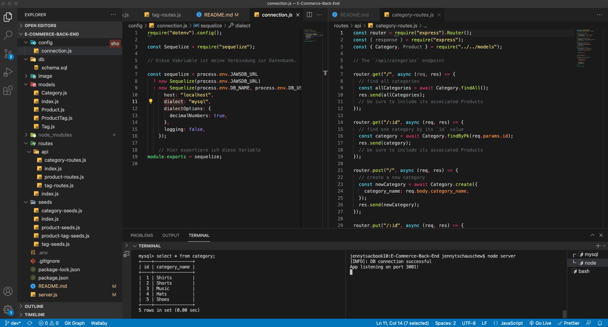

# 13 Object-Relational Mapping (ORM): E-Commerce Back End

Table of content

- [13 Object-Relational Mapping (ORM): E-Commerce Back End](#13-object-relational-mapping-orm-e-commerce-back-end)
- [Description](#description)
- [Building Structure](#building-structure)
- [Screenshots](#screenshots)
- [Tech/Framwork used](#techframwork-used)
- [Repositery content + link](#repositery-content--link)

# Description

This application allows - by using a back-end working with Express.js API and Sequelize to interacht with the MySQL database - an user to have a back end for a e-commerce website. For now - for demonstration purposes, see walkthrough video - the application code is functional on the developers machine (MySQL login/.env).

The application itself containes a database with different tables (models) for different item categories, products and tags. The tables als partly linked to each other and a basic data is given by seeds files.

The User can check the database, can add, delete and update data through the commandline or rather by using a API Design Platform like insomnia.rest.

# Building Structure

The starter code has been modified as followw:

- Install all dependencies ("dotenv", "express", "mysql2", "sequelize")
- Setting up the server.js file to get the server running by using "sequelize"
- Database login gets supported by an .env file
- Setting up the database by completing the database models as requiered
- The connection file establishes the database connection by using "sequelize" in node.js, the .env as well as by naming the host (localhost) and dialect (MySQL)
- The API routes are setting up the relation between the tabels and the requests (get, post, put and delete) by using express.js
- ...

# Screenshots

# Tech/Framwork used

- Node.js
- npm packages: require, dotenv, express, sequelize
- JavaScript
- mySQL2

# Repositery content + link

- config
  - connection.js
- db
  - schema.sql
- image
  - 1-Screenshot.png
- models
  - Category.js
  - index.js
  - Product.js
  - ProductTag.js
  - Tag.js
- node_modules
  - ...
- routes

  - api
    - category-routes.js
    - index.js
    - product-routes.js
    - tag-routes.js
  - index

- seeds
  - category-seeds.js
  - index.js
  - product-seeds.js
  - product-tag-seeds.js
  - tag-seeds.js
- .env
- .gitignore
- package-lock.json
- package.json
- README.md
- server.js

- GitHub (dev branch): https://github.com/JenBerlin/Employee-Tracker/pull/1
- Walkthrough-Video: https://drive.google.com/file/d/1swQvT589002EUIxXz-TQp0FyrmelDmSR/view?usp=sharing
